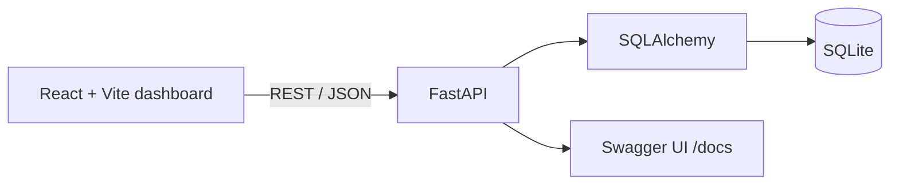

# IT Helpdesk & Asset Management System

A polished portfolio MVP that models an IT service desk workspace: agents can triage tickets, maintain an asset inventory, manage users, and view operational reporting. It is deliberately scoped as a demo, not a production enterprise system.

## 1. Project Overview

ServiceDesk provides a realistic UI and REST API for everyday IT support workflows. It is intended to demonstrate practical frontend, backend, database, API, and support-domain knowledge for IT support, helpdesk, operations, and junior full-stack roles.

## 2. Problem Statement

Small IT teams often need a simple, single view of user requests, their device estate, and service performance. This demo shows how these activities can be organized into a clean operational workflow.

## 3. Project Goals

- Make ticket status, ownership, priority, and SLA visibility easy to scan.
- Keep asset and user records accessible to support staff.
- Provide a realistic, responsive dashboard with meaningful demo data.
- Expose a straightforward REST API backed by SQLite.

## 4. Features

- Dashboard with seven service metrics, charts, recent tickets, and system health.
- Ticket search/filtering and create, edit, status/priority update, and deletion workflows.
- Asset inventory search/filtering and full CRUD operations.
- User directory search and full CRUD operations.
- Reports for resolution rate, open/resolved workload, department, priority, asset status, and monthly trend.
- First-run seed data: 15 users, 20 tickets, and 15 assets.
- Loading, error, empty, responsive, notification, and confirmation states.

## 5. Tech Stack

| Layer | Technology |
| --- | --- |
| Frontend | React, Vite, JavaScript, Recharts, Lucide icons, responsive CSS |
| Backend | Python, FastAPI, SQLAlchemy, Pydantic |
| Database | SQLite |
| API tools | REST API, Swagger / OpenAPI, Postman-compatible endpoints |
| DevOps | Git, Docker Compose (optional) |

## 6. System Architecture



## 7. Project Structure

```text
it-helpdesk-system/
├── frontend/                 # React/Vite user interface
│   └── src/
│       ├── components/       # Layout, modal, and UI states
│       ├── pages/            # Dashboard, Tickets, Assets, Users, Reports, Settings
│       └── api.js            # REST client
├── backend/
│   └── app/
│       ├── main.py           # FastAPI routes and metrics endpoints
│       ├── models.py         # SQLAlchemy User, Ticket, Asset models
│       ├── schemas.py        # Pydantic request/response schemas
│       └── seed.py           # Curated startup demo data
├── docker-compose.yml
└── README.md
```

## 8. Screenshots

These screenshots were captured from the seeded local demo at a desktop viewport.

### Dashboard


### Tickets


### Assets


### Users


### Reports


## 9. Installation

Prerequisites: Node.js 20+ and Python 3.10+.

```powershell
cd it-helpdesk-system
```

## 10. Running the Backend

```powershell
cd backend
python -m venv .venv
.\.venv\Scripts\Activate.ps1
pip install -r requirements.txt
uvicorn app.main:app --reload
```

The backend starts at `http://127.0.0.1:8000`. On its first start it automatically creates `helpdesk.db` and seeds the demo records.

## 11. Running the Frontend

Open a second terminal:

```powershell
cd it-helpdesk-system\frontend
npm install
npm run dev
```

Open `http://localhost:5173`.

To target another API address, create `frontend/.env` with `VITE_API_URL=http://host:port/api`.

## 12. API Endpoints

| Resource | Endpoints |
| --- | --- |
| Tickets | `GET/POST /api/tickets`, `GET/PUT/DELETE /api/tickets/{id}` |
| Assets | `GET/POST /api/assets`, `GET/PUT/DELETE /api/assets/{id}` |
| Users | `GET/POST /api/users`, `GET/PUT/DELETE /api/users/{id}` |
| Dashboard | `GET /api/dashboard/stats` |
| Reports | `GET /api/reports/summary` |
| Health | `GET /api/health` |

Interactive Swagger documentation is available at `http://127.0.0.1:8000/docs`.

## 13. Demo Data

The curated demo data represents the fictional **Northstar** organization. It includes IT and non-IT staff, typical company hardware/network devices, and realistic incidents such as Wi-Fi, Outlook, VPN, printer, MFA, endpoint protection, and access issues.

## 14. Future Improvements

- Authentication and role-based access controls.
- Ticket comments, attachments, and activity audit history.
- Pagination, server-side sorting, and richer SLA calculations.
- Automated tests, CI workflow, and database migrations.
- Production deployment configuration and persistent database volume.

## 15. Author

Built as an IT support and full-stack portfolio project by **Waleed**.

## Optional Docker startup

```powershell
cd it-helpdesk-system
docker compose up --build
```

This is a development convenience only; normal local startup above remains the recommended path for this portfolio MVP.


