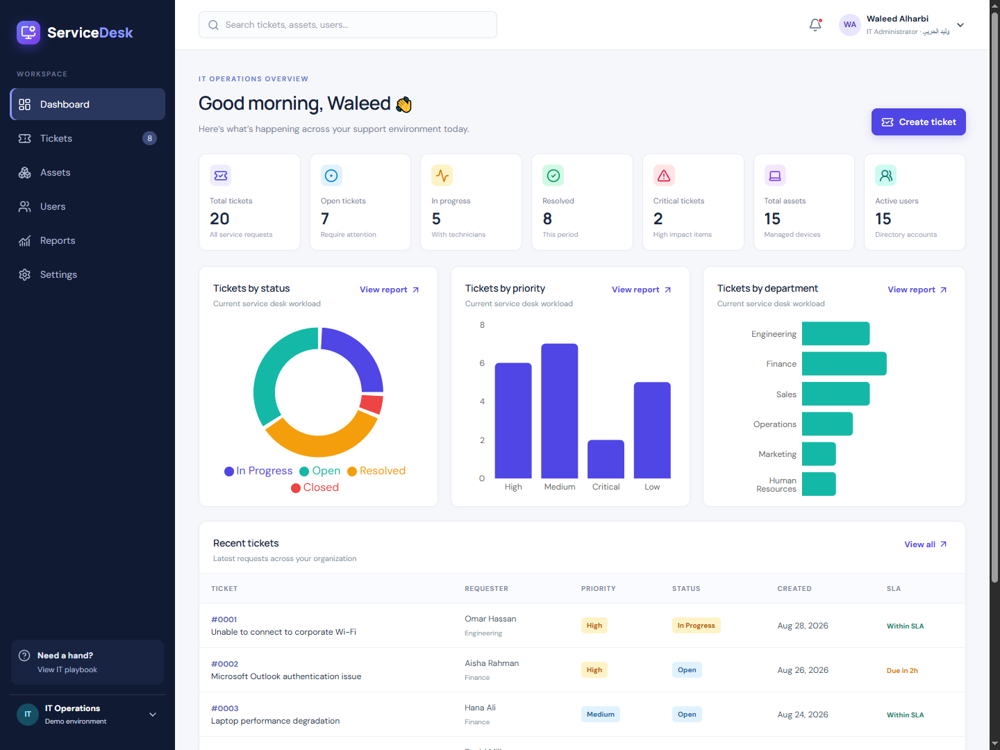
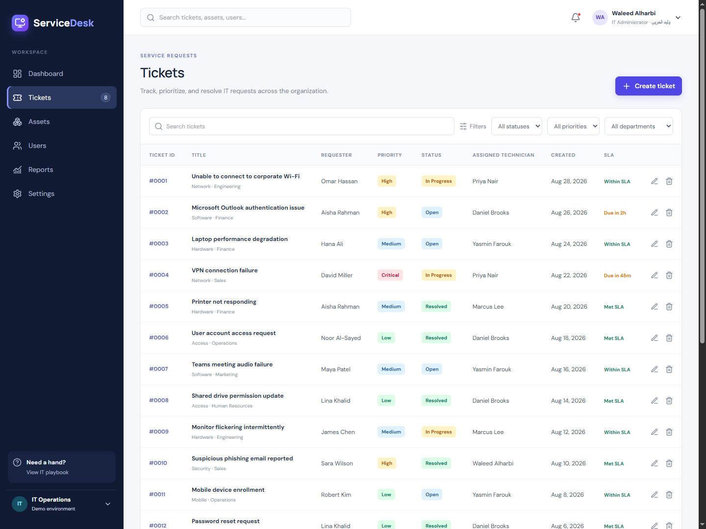
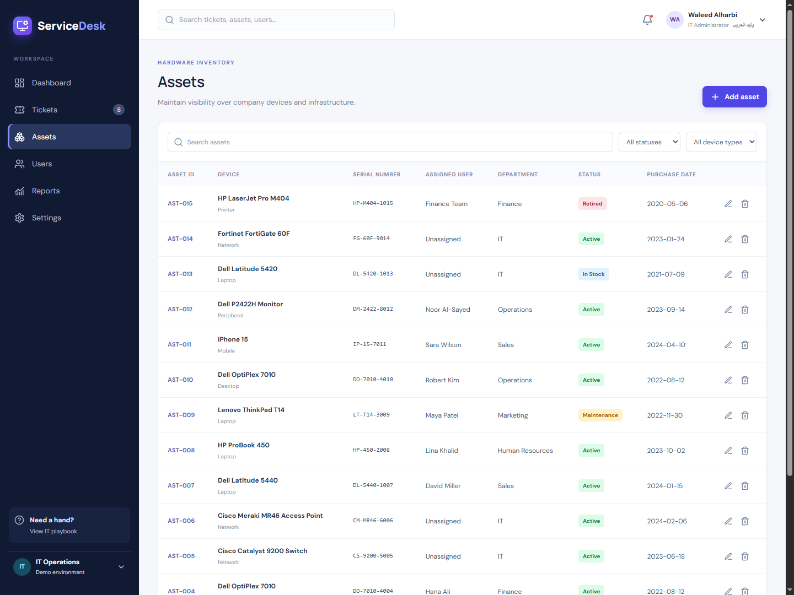
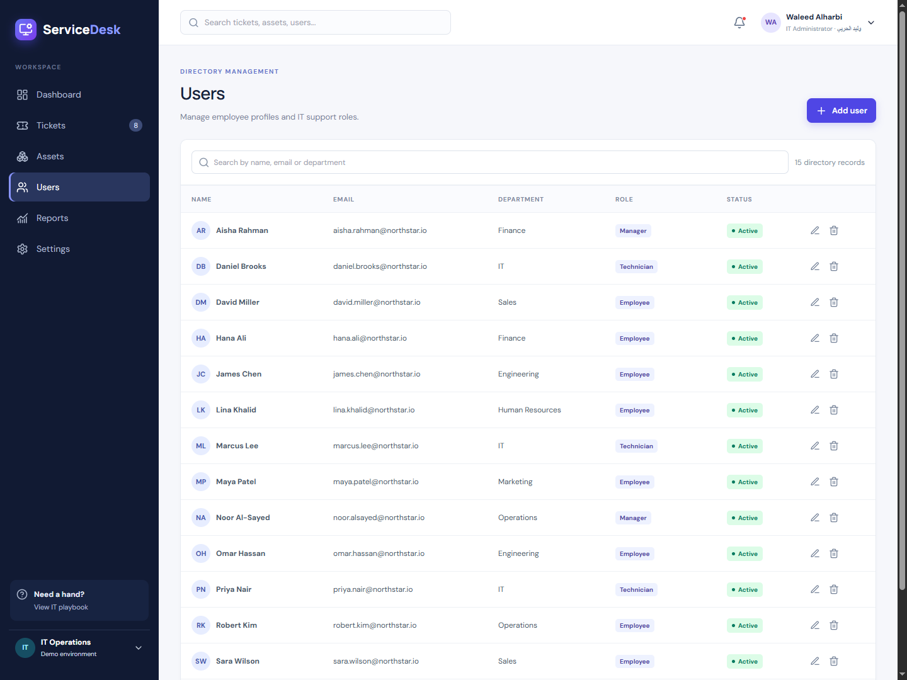
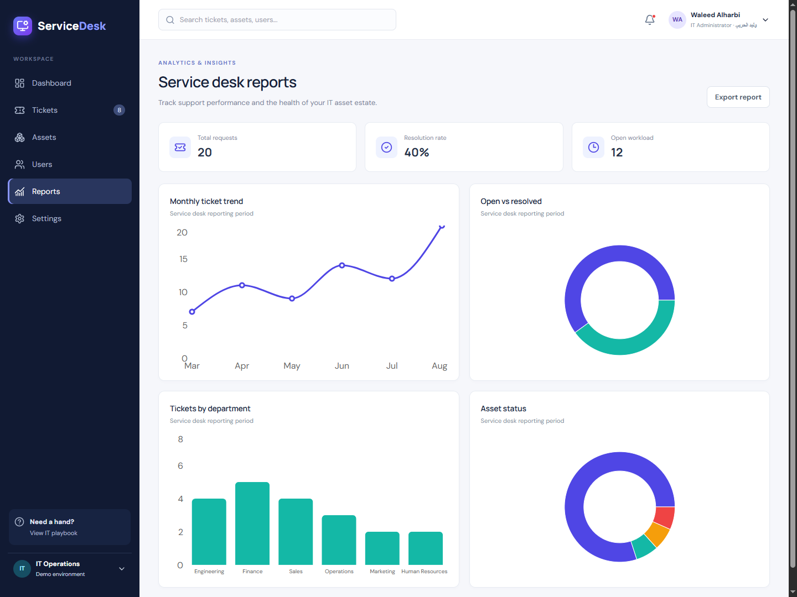
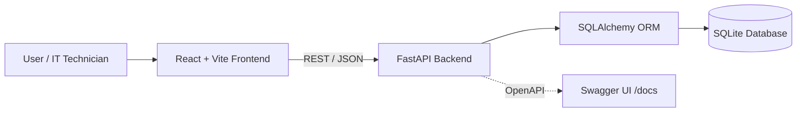

<div align="center">

<h1>IT Helpdesk &amp; Asset Management System</h1>

<p>A modern portfolio MVP for IT service management, ticket tracking, asset management, and IT operations.</p>

<p>
  
  
  
  
  
  
</p>

<p><strong>IT Support</strong> &nbsp;·&nbsp; <strong>IT Operations</strong> &nbsp;·&nbsp; <strong>Systems</strong> &nbsp;·&nbsp; <strong>Full Stack Development</strong></p>

</div>

---

## Project Description

This project is a portfolio MVP that models a practical IT service desk workspace. It brings together helpdesk workflows, asset management, user management, and operational reporting in one responsive application.

It is designed to demonstrate the technical areas relevant to IT Support, IT Operations, service desk, systems support, and junior full-stack roles: REST APIs, database integration, frontend development, backend development, and realistic support workflows. It is intentionally scoped as a demo—not a production enterprise application.

## Project Preview

<div align="center">
  
</div>

<p align="center"><em>Dashboard view showing current ticket workload, IT assets, active users, and support trends.</em></p>

## Key Features

### Ticket Management

- Search tickets and filter by status, priority, and department.
- Create, update, and delete ticket records.
- Track requester, category, assigned technician, priority, status, created date, and SLA indicator.

### Asset Management

- Maintain an inventory of laptops, desktops, network devices, mobile devices, peripherals, and printers.
- Add, edit, search, filter, and remove asset records.
- View ownership, department, serial number, purchase date, and lifecycle status.

### User Management

- Search the organization directory by name, email, or department.
- Add, edit, and remove user records.
- Manage department, role, and active/inactive status.

### Dashboard &amp; Reporting

- Monitor ticket, asset, and active-user summary metrics.
- Visualize ticket status, priority, and department distribution.
- Review recent tickets, resolution rate, open versus resolved workload, asset status, and monthly ticket trends.

### User Experience

- Responsive enterprise-style navigation, tables, forms, status badges, and feedback states.
- Loading, error, empty, notification, and deletion-confirmation states across management workflows.

## Screenshots

### Dashboard

<div align="center">
  
</div>

### Ticket Management

<div align="center">
  
</div>

### Asset Management

<div align="center">
  
</div>

### User Management

<div align="center">
  
</div>

### Reports &amp; Analytics

<div align="center">
  
</div>

## Technology Stack

| Area | Technologies |
| --- | --- |
| Frontend | React 18, Vite, JavaScript, Tailwind CSS, PostCSS, Recharts, Lucide React |
| Backend | Python, FastAPI, SQLAlchemy, Pydantic, Uvicorn |
| Database | SQLite |
| API | REST/JSON, Swagger UI, OpenAPI |
| Development Tools | Git, GitHub, npm, pip |
| DevOps | Docker, Docker Compose |

## System Architecture



The React frontend consumes the FastAPI REST API. FastAPI uses SQLAlchemy to persist users, tickets, and assets to a local SQLite database; its interactive OpenAPI documentation is available through Swagger UI when the backend is running.

## Project Structure

```text
it-helpdesk-asset-management/
├── frontend/
│   ├── src/
│   │   ├── components/          # Shared layout, modal, and state components
│   │   ├── pages/               # Dashboard, tickets, assets, users, reports, settings
│   │   ├── api.js               # REST API client
│   │   ├── App.jsx
│   │   └── main.jsx
│   ├── package.json
│   ├── vite.config.js
│   ├── tailwind.config.js
│   └── Dockerfile
├── backend/
│   ├── app/
│   │   ├── database.py          # SQLite connection and session dependency
│   │   ├── models.py            # SQLAlchemy models
│   │   ├── schemas.py           # Pydantic request/response schemas
│   │   ├── seed.py              # Curated demo data
│   │   └── main.py              # FastAPI application and routes
│   ├── requirements.txt
│   └── Dockerfile
├── screenshots/
│   ├── dashboard.png
│   ├── tickets.png
│   ├── assets.png
│   ├── users.png
│   └── reports.png
├── docker-compose.yml
├── .gitignore
└── README.md
```

## REST API

The API is available after the backend starts. Interactive Swagger/OpenAPI documentation: [http://127.0.0.1:8000/docs](http://127.0.0.1:8000/docs).

| Resource | HTTP methods | Endpoint |
| --- | --- | --- |
| Health | `GET` | `/api/health` |
| Tickets | `GET`, `POST` | `/api/tickets` |
| Ticket by ID | `GET`, `PUT`, `DELETE` | `/api/tickets/{ticket_id}` |
| Assets | `GET`, `POST` | `/api/assets` |
| Asset by ID | `GET`, `PUT`, `DELETE` | `/api/assets/{asset_id}` |
| Users | `GET`, `POST` | `/api/users` |
| User by ID | `GET`, `PUT`, `DELETE` | `/api/users/{user_id}` |
| Dashboard | `GET` | `/api/dashboard/stats` |
| Reports | `GET` | `/api/reports/summary` |

## Demo Data

On first startup, the application creates a local SQLite database and loads curated fictional data for the Northstar demo organization:

| Record type | Seeded records |
| --- | ---: |
| Users | 15 |
| Tickets | 20 |
| Assets | 15 |

The records represent realistic support scenarios—such as Wi-Fi, Outlook, VPN, printer, access, endpoint protection, and hardware issues—for demonstration purposes only.

## Getting Started

### Prerequisites

- Python 3.10 or later
- Node.js 20 or later
- npm
- Docker Desktop (optional, for Docker Compose)

### Clone the Repository

```powershell
git clone https://github.com/Waleed-Alharbi/it-helpdesk-asset-management.git
cd it-helpdesk-asset-management
```

### Run the Backend

Open the first terminal:

```powershell
cd backend
python -m venv .venv
.\.venv\Scripts\python.exe -m pip install -r requirements.txt
.\.venv\Scripts\python.exe -m uvicorn app.main:app --reload
```

The backend runs at [http://127.0.0.1:8000](http://127.0.0.1:8000). The database is created and seeded automatically on first startup.

### Run the Frontend

Open a second terminal:

```powershell
cd frontend
npm.cmd install
npm.cmd run dev
```

Open the application at [http://localhost:5173](http://localhost:5173). If PowerShell permits the `npm` command directly, `npm install` and `npm run dev` are equivalent.

### Local URLs

| Service | URL |
| --- | --- |
| Frontend | [http://localhost:5173](http://localhost:5173) |
| FastAPI backend | [http://127.0.0.1:8000](http://127.0.0.1:8000) |
| Swagger / OpenAPI | [http://127.0.0.1:8000/docs](http://127.0.0.1:8000/docs) |

## Docker

Docker Compose is included as a local development convenience. It builds and exposes both the FastAPI backend and Vite frontend:

```powershell
docker compose up --build
```

This setup is intentionally lightweight and is not presented as a production deployment configuration.

## Skills Demonstrated

- IT support workflows, service desk concepts, ticket prioritization, and SLA awareness.
- IT operations visibility through asset inventory and operational reporting.
- Full-stack CRUD development with React, FastAPI, SQLAlchemy, and SQLite.
- REST API design, OpenAPI documentation, and frontend-to-backend integration.
- Dashboard development and data visualization with Recharts.
- Responsive UI composition, reusable React components, and user feedback states.
- Git, GitHub, Docker fundamentals, software architecture, and technical documentation.

## Future Improvements

The following are potential next steps and are not part of the current MVP:

- Authentication and role-based access control.
- Ticket comments, attachments, audit history, pagination, and richer SLA automation.
- PostgreSQL, migrations, automated tests, CI/CD, and cloud deployment.
- Advanced analytics, server-side sorting, and workflow automation.

## Portfolio Purpose

This project exists to demonstrate how IT Support, IT Operations, systems thinking, backend APIs, frontend development, and database management can be combined into a realistic technical portfolio project. It is intended as a modest, explainable example of practical full-stack and support-domain skills.

## Author

**Waleed Alharbi**   
GitHub: [Waleed-Alharbi](https://github.com/Waleed-Alharbi)
